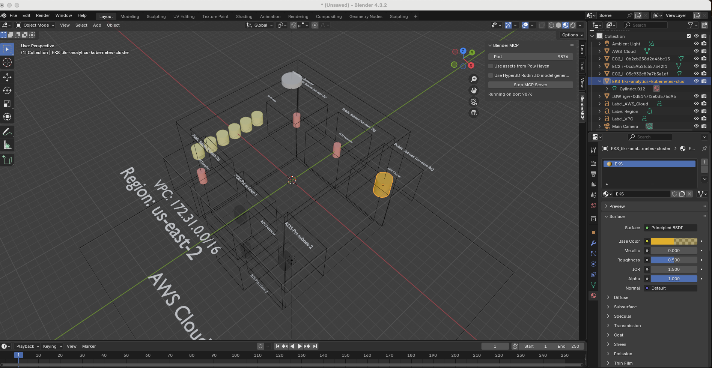
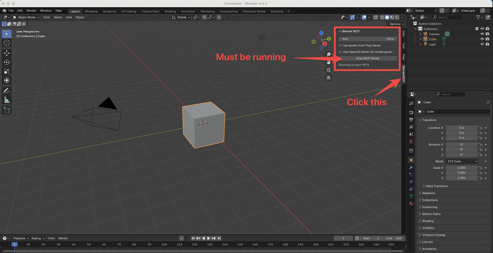

# aws-to-blender

A fun way to visualize your AWS Infrastructure in 3D



## Prerequisites

You must install Amazon Q to get access to your AWS infrastructure, the Blender
App and the Blender-mcp plugin to enable Amazon Q to visualize your AWS
infrastructure in 3D.

[Amazon Q](https://aws.amazon.com/q/)
[Blender](https://www.blender.org/download/)
[Blender-mcp](https://github.com/ahujasid/blender-mcp)

See [mcp.json](./docs/mcp.json) for the MCP configuration.

You should see this when you have Blender running with the MCP server add on:



### Amazon Q

I've added an `.amazonq/mcp.json` in this project so you should be able to
launch `q` in this directory and ask the Agent.

## Usage

Launch `q` in this directory.

```bash
q
```

There are going to be a lot of requests to the Blender tools so you can decide
to trust the tools or not.

```text
/tools trustall
```

See if the MCP server is working:

```text
Using the Blender tools, load the scene and describe what you see
```

If it is working, it should describe a cube if you have just started a new
Blender project.

## Visualize your AWS infrastructure:

In `q`, you can ask the Agent to visualize your AWS infrastructure (the
[prompt](./docs/aws-to-blender-prompt.md)).

```text
You are an expert at AWS Infrastructure 3D visualizations.

First, use the blender tool to clear any existing objects. If you have any
errors, tell the user to install Blender, Blender-mcp and make sure it works.

Then, you will enumerate all infrastructure in the AWS infrastructure in
AWS_REGION (if set). Once you have all infrastructure, ultrathink deeply about
the layout (first) then use the Blender tools to create a 3D visualization of
the infrastructure.

Apply these rules with objects:

- For anything that contains objects such as AWS_Cloud (the top level
  container), Region, VPCs, Private Subnets, etc., set the material surface to
  "Transparent BSDF" and viewport display_type = 'WIREFRAME' and
  show_transparent = True so that the user can see the contained objects.
- For Objects which do not contain other objects (EC2 servers, buckets, RDS
  instances, etc) use an viewport display color alpha of 0.3 so that they are
  visible.
- For Text, set the viewport display color alpha to 1.0 so that it stands out.

Use Text callouts for VPCs and larger components. The text callouts should be
outside of the containing object. Do not add any lines to long cylinders
connecting components to the scene. Just add the components and containers.
```
